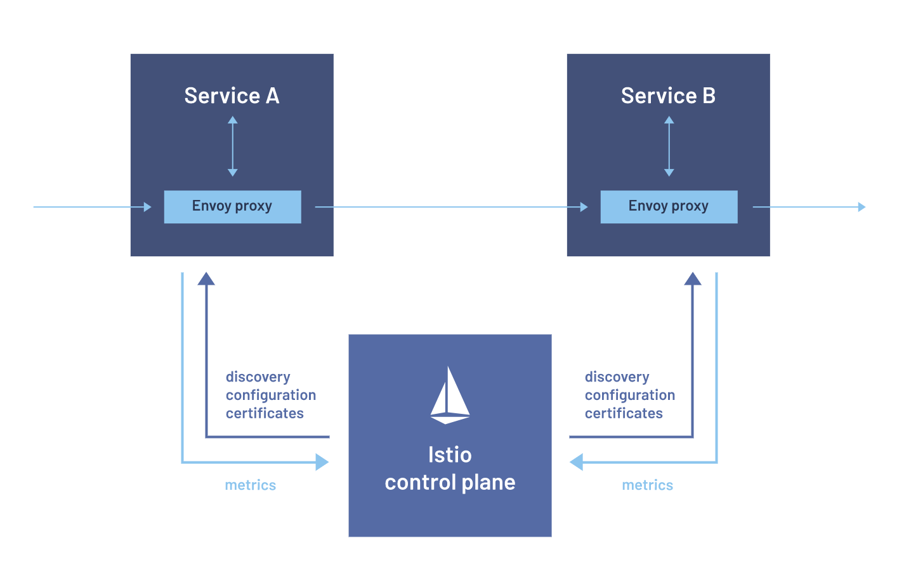
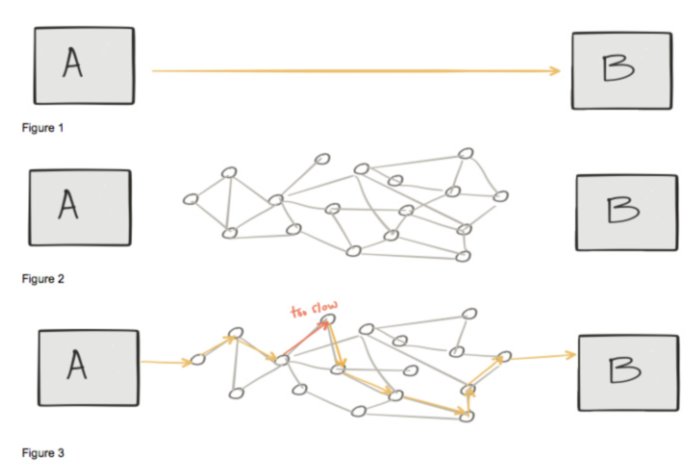

# istio

istio는 서비스 메쉬(Service Mesh)를 구현할 수 있는 오픈소스이다.  
서비스 코드 변경 없이 로드밸런싱, 서비스 간 인증, 모니터링 등을 적용하여 마이크로 서비스를 관리할 수 있다.  
마이크로 서비스 간의 모든 네트워크 통신을 담당할 수 있는 프록시인 Envoy를 사이드카 패턴으로 마이크로 서비스들에 배포한 다음, 프록시들의 설정값 저장 및 관리/감독을 수행하고, 프록시들에 설정값을 전달하는 컨트롤러 역할을 수행한다.  

## why
"마이크로서비스의 가장 어려운 부분 : 서비스 호출"  
API를 호출할 때 A-B 직접 통합(아래 그림 1)을 다룬다고 생각할 수 있다.  
그러나 컴퓨터 네트워크는 직접 통신에 최적화되도록 설계되지 않으며(그림 2),  
특히 클라우드 환경을 고려 또는 사용 중인 경우 통제 범위를 벗어난 많은 실제 및 가상 네트워크 디바이스를 다루게 된다.  
예를 들어 이런 디바이스 중 하나의 성능이 저하되는 경우 전체 애플리케이션 응답 시간이 영향을 받는다(그림 3)  

service의 micro화로 인해 service의 양과 상호 연결의 복잡도가 증가하여 service들을 효율적으로 관리할 필요가 발생했다.  
-> 다수의 컨테이너가 동작하는 경우에는 각 컨테이너의 트래픽을 관찰하고 정상 동작하는지 모니터링하기가 어렵다.  

## 데이타 플레인(Data Plane)
Envoy Proxy 세트로 구성  
Envoy는 사이드카 방식으로 각각의 마이크로서비스에 배포되어 서비스로 들어오고 나가는 모든 트래픽을 통제한다.  

## 컨트롤 플레인(Control Plane)
데이터 플레인(Data Plane)인 Envoy 컨트롤  
Istiod: 서비스 디스커버리(Service Discovery), 설정 관리(Configuration Management), 인증 관리(Certificate Management)  
- 트래픽 동작을 제어하는 라우팅 규칙을 Envoy 전용 설정으로 변환하고, 마이크로 서비스에 사이드카 방식으로 Envoy를 배포  
- Envoy 설정 변경(Istio의 Traffic Management API 활용)을 통한 서비스 메시 트래픽 세부 제어  
- 내장된 identity나 자격증명관리(Credential Management)를 통해 강력한 서비스 간 인증 및 사용자 인증 기능 지원  
- 인증기관(Certificate Authority. CA) 역할 수행  

### 트래픽 관리(Traffic Management)
규칙(Rule) 설정과 트래픽 라우팅(Traffic Routing) 기능을 통해 서비스 간의 트래픽 흐름과 API 호출을 제어할 수 있다.  
서킷 브레이커(Circuit Breaker), 타임아웃(Timeout), 재시도(Retry) 기능과 같은 서비스 레벨의 속성 구성을 단순화하고, 백분율 기반으로 트래픽을 분할하여 A/B Test, 단계적(Staged) Rollout 과 같은 작업을 설정할 수 있다.  

### 보안(Security)
인증(Authentication), 권한부여(Authorization), 암호화(Encryption) 등을 관리한다. 기본적으로 서비스 통신은 보호되기 때문에, 프로토콜이나 런타임에서 어플리케이션 변경을 거의 하지 않고 일관된 정책을 시행할 수 있다.  

### 관찰 가능성(Observability)
트레이싱(Tracing), 모니터링(Monitoring), 로깅(Logging) 기능으로 서비스 매쉬에 배포된 서비스들에 대해 더욱 자세히 파악할 수 있다. Istio의 모니터링 기능을 통해 서비스 성능이 업스트림/다운스트림에 어떤 영향을 끼치는지 파악할 수 있다.  

#### Circuit Breaker
문제가 발생한 지점을 감지하고, 실패 작업이 반복적으로 실행되지 않도록 방지한다.  
장애 확산을 막고, 바로 응답을 반환하여 사용자 대기를 낮춘다.  
회로 차단 닫힘: 일반적인 경우 회로 차단기를 닫고, 서비스를 유지한다. 일정 수치가 초과되면, 회로 차단을 열림 상태로 변경한다.  
회로 차단 열림: 요청 후 바로 응답을 반환한다.   
회로 차단기 반열림: 제한된 요청을 허용한다.  

https://www.itworld.co.kr/news/109449. 
https://istio.io/. 
https://medium.com/@jwlee98/gcp-gke-%EC%B0%A8%EA%B7%BC-%EC%B0%A8%EA%B7%BC-%EC%95%8C%EC%95%84%EB%B3%B4%EA%B8%B0-7%ED%83%84-istio-%EB%A1%9C-%ED%95%98%EB%8A%94-service-mesh-9e9363945cbb. 
https://martinfowler.com/bliki/CircuitBreaker.html