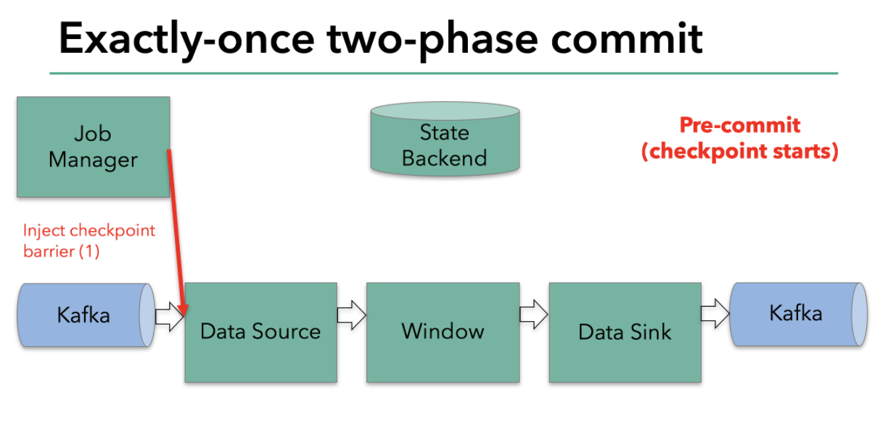
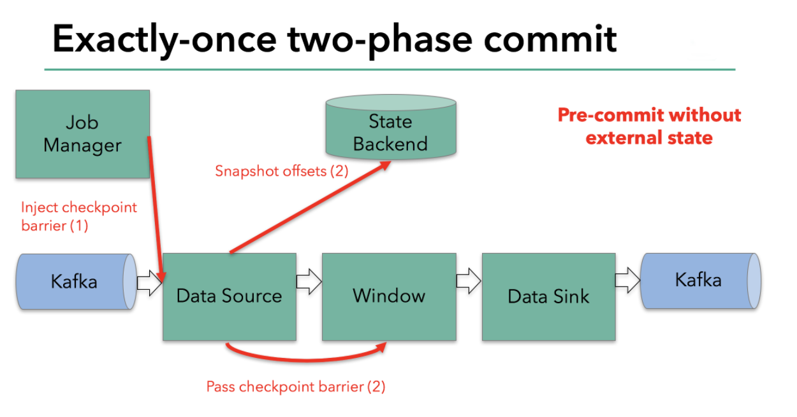
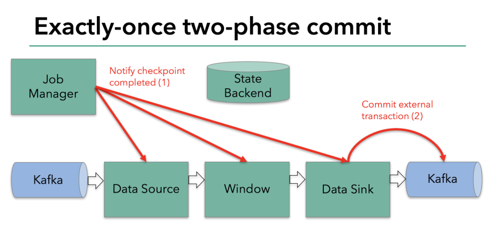

# Flink
- 네이티브 스트림(Native Stream): 플링크는 일괄처리도 지원하지만 스트림 프로세싱을 주목적으로 사용한다. 경량의 분산 스냅샷을 구현하여 오버헤드는 낮으면서도 Exactly-once의 이벤트 처리를 보장할 수 있다.
- 인메모리(In-Memory): 자바 애플리케이션으로 JVM(Java Virtual Machine)에서 실행되지만 JVM GC(Garbage Collector)에 전적으로 의존하지 않는다. 대신 커스텀 메모리 매니저를 구현하여 안정적인 메모리 사용량을 유지하면서 성능을 향상한다.
- 낮은 지연과 높은 처리량(Throughput): 경쟁 제품에 비하여 지연과 처리량에서 우수한 성능을 보인다. 플링크는 데이터를 처리하는 과정에서 변경된 부분만 재처리하도록 설정하여 처리 속도를 더 높일 수도 있다.
- 손쉬운 설정과 사용 그리고 강력한 부가 기능: 스파크는 파라미터 설정이 복잡하지만 플링크는 별다른 설정 없이 사용할 수 있다. 입력되는 이벤트 스트림에 개별로 접근할 수 있고, 강력한 윈도우 연산자를 사용하여 분석을 수행할 수 있다. 고급 분석용 API부터 상세한 제어가 가능해지는 상태 저장 이벤트 기반 애플리케이션 수준까지 계층에 따른 API를 제공한다.
- 플링크에서 데이터는 소스(Source)로 시작해 싱크(Sink)로 끝난다. 데이터가 입력되어 처리가 완료되기까지 각 단계는 스트림으로 이동하고 오퍼레이터에 의하여 데이터가 처리된다. 소스는 데이터 입력을 정의하는 단계로 원천시스템의 로그, 클릭 이벤트, IoT 장치 등에서 발생하는 데이터를 실시간 이벤트 스트림이나 데이터베이스, 파일, 키-밸류 스토어(Key-Value Store) 수신된다.
- 트랜스포메이션(Transformation)은 데이터를 가공하는 작업이다. 스트림 내의 특정 값에 가중치를 주거나 분석하여 새로운 스트림을 형성할 수도 있고 특정 키(Key) 값 기반 스트림을 처리할 수도 있다. 스트림 처리 시스템의 기본 개념인 윈도우(Window) 관련 기능도 제공한다.

## Process Unbounded and Bounded Data
### Unbounded
시작은 있지만 정의된 끝은 없다. 종료되지 않으며 생성되는 데이터를 제공한다. 무제한 스트림은 지속적으로 처리되어야 한다. 즉, 이벤트는 수집된 후 즉시 처리되어야 합니다. 입력이 제한되지 않고 특정 시점에 완료되지 않기 때문에 모든 입력 데이터가 도착할 때까지 기다릴 수 없다. 무제한 데이터를 처리하려면 결과 완전성에 대해 추론할 수 있도록 이벤트가 발생한 순서와 같은 특정 순서로 이벤트를 수집해야 하는 경우가 많다.

### Bounded
정의된 시작과 끝이 있다. 제한된 스트림은 계산을 수행하기 전에 모든 데이터를 수집하여 처리할 수 있다. 제한된 데이터 세트는 항상 정렬할 수 있으므로 제한된 스트림을 처리하는 데 정렬된 수집이 필요하지 않는다. 제한된 스트림의 처리는 일괄 처리라고도 한다.

- kafka > setUnbounded
  - 기본적으로 KafkaSource는 Boundedness.CONTINUOUS_UNBOUNDED 으로 설정되어 있어, Flink 작업이 실패하거나 취소될 때까지 중지되지 않는다. KafkaSource를 특정 지점에서 중지되도록 하려면 각 파티션에 대해 중지 오프셋을 지정하도록 Boundedness.BOUNDED설정할 수 있다.
  - OffsetsInitializer 파티션이 중지 오프셋에 도달하면 KafkaSource가 종료된다.
````
OffsetsInitializer.latest(): KafkaSource가 실행되기 시작할 때 파티션의 최신 오프셋에서 중지
OffsetsInitializer.committedOffsets(): consumer group의 커밋된 오프셋에서 중지.
OffsetsInitializer.offsets(Map)- 각 파티션에 대해 지정된 오프셋에서 중지
OffsetsInitializer.timestamp(long)- 각 파티션에 대해 지정된 타임스탬프에서 중지
````
https://nightlies.apache.org/flink/flink-docs-stable/api/java/org/apache/flink/connector/kafka/source/KafkaSourceBuilder.html  
````
KafkaSource<String> source = KafkaSource
        .<String>builder()
        .setBootstrapServers(...)
        .setGroupId(...)
        .setTopics(...)
        .setDeserializer(...)
        .setStartingOffsets(OffsetsInitializer.earliest())
        .setBounded(OffsetsInitializer.latest())
        .build();
````
// OffsetsInitializer를 구현하여 CustomOffsetsInitializer 정의하여 특정 Kafka partition stop offset 설정
````
class CustomOffsetsInitializer implements OffsetsInitializer {

    private static final long serialVersionUID = 1649702397250402877L;

    private final OffsetResetStrategy offsetResetStrategy;
    private Integer count;

    CustomOffsetsInitializer(OffsetResetStrategy offsetResetStrategy, Integer count) {
        this.offsetResetStrategy = offsetResetStrategy;
        this.count = count;
    }

    @Override
    public Map<TopicPartition, Long> getPartitionOffsets(Collection<TopicPartition> partitions, PartitionOffsetsRetriever partitionOffsetsRetriever) {
        Map<TopicPartition, Long> offsets = new HashMap<>();
        // 구현
        return offsets;
    }

    @Override
    public OffsetResetStrategy getAutoOffsetResetStrategy() {
        return offsetResetStrategy;
    }
}
````

## Time
대부분의 이벤트 스트림에는 각 이벤트가 특정 시점에 생성되기 때문에 고유한 시간 의미가 있다. 또한 Windows 집계, 세션화, 패턴 감지 및 시간 기반 조인과 같은 많은 일반적인 스트림 계산은 시간을 기반으로 한다. 스트림 처리의 중요한 측면은 응용 프로그램이 시간, 즉 이벤트 시간과 처리 시간의 차이를 측정하는 방법이다.
- Event-time Mode: 이벤트 시간 의미 체계로 스트림을 처리하는 애플리케이션은 이벤트의 타임스탬프를 기반으로 결과를 계산한다. 따라서 이벤트 시간 처리는 기록된 이벤트 또는 실시간 이벤트 처리 여부에 관계없이 정확하고 일관된 결과를 허용한다.
- Watermark Support: Flink는 이벤트 시간 애플리케이션에서 시간을 추론하기 위해 워터마크를 사용한다. 워터마크는 결과의 대기 시간과 완전성을 절충하는 유연한 메커니즘이다.
- Late Data Handling: 워터마크가 있는 이벤트 시간 모드에서 스트림을 처리할 때 모든 관련 이벤트가 도착하기 전에 계산이 완료될 수 있다. 이러한 이벤트를 후기 이벤트라고 한다. Flink는 사이드 출력을 통해 경로를 변경하고 이전에 완료된 결과를 업데이트하는 등 늦은 이벤트를 처리하기 위한 여러 옵션을 제공한다.
- Processing-time Mode:  이벤트 시간 모드 외에도 Flink는 처리 기계의 벽시계 시간에 의해 트리거되는 계산을 수행하는 처리 시간 의미 체계도 지원한다. 처리 시간 모드는 대략적인 결과를 허용할 수 있는 엄격한 저지연 요구 사항이 있는 특정 애플리케이션에 적합할 수 있다.

## kafka exactly once
- checkpoint가 있으며, commit/rolleback 기능 제공
- 두 체크포인트 사이의 모든 write 묶음, write 실패 시 rollback
- 모든 operators pre-commit 을 완료하면 commit
- 최소한 하나의 pre-commit 이 실패하면 다른 모든 commit이 중단되고, 이전에 성공적으로 완료된 checkpoint로 rollback
- After a successful pre-commit, the commit must be guaranteed to eventually succeed – both our operators and our external system need to make this guarantee. If a commit fails, the entire Flink application fails, restarts according to the user’s restart strategy, and there is another commit attempt. This process is critical because if the commit does not eventually succeed, data loss occurs.





## CEP
- Complex event processing for Flink
- Flink 위에 구현된 CEP(복합 이벤트 처리) 라이브러리
- 이벤트 패턴 감지
- 각각의 복잡한 패턴 시퀀스는 여러 개의 단순 패턴, 동일한 속성을 가진 개별 이벤트를 찾는 패턴으로 구성된다.
- 각 패턴에는 일치하는 이벤트를 식별하는 데 사용하는 고유한 이름이 있어야 한다.
````
<dependency>
    <groupId>org.apache.flink</groupId>
    <artifactId>flink-cep_2.11</artifactId>
    <version>1.14.4</version>
</dependency>
````
````
Pattern<Event, ?> pattern = Pattern.<Event>begin("start").where(
        new SimpleCondition<Event>() {
            @Override
            public boolean filter(Event event) {
                return event.getId() == 42;
            }
        }
    ).next("middle").subtype(SubEvent.class).where(
        new SimpleCondition<SubEvent>() {
            @Override
            public boolean filter(SubEvent subEvent) {
                return subEvent.getVolume() >= 10.0;
            }
        }
    ).followedBy("end").where(
         new SimpleCondition<Event>() {
            @Override
            public boolean filter(Event event) {
                return event.getName().equals("end");
            }
         }
    );

PatternStream<Event> patternStream = CEP.pattern(input, pattern);

DataStream<Alert> result = patternStream.process(
    new PatternProcessFunction<Event, Alert>() {
        @Override
        public void processMatch(
                Map<String, List<Event>> pattern,
                Context ctx,
                Collector<Alert> out) throws Exception {
            out.collect(createAlertFrom(pattern));
        }
    });
````

## Standalone - Kuberneties
- Flink는 독립 실행형 배포(리소스 관리를 수행하는 데 사용할 수 있는 클러스터 프레임워크가 없는 경우)에서와 같이 작동한다.

### session mode
- 여러 Flink Job을 실행, 클러스터가 배포된 후 각 Job을 클러스터에 Submit
- a Deployment which runs a JobManager
- a Deployment for a pool of TaskManagers
- a Service exposing the JobManager’s REST and UI ports
````
# Configuration and service definition
$ kubectl create -f flink-configuration-configmap.yaml
$ kubectl create -f jobmanager-service.yaml

# Create the deployments for the cluster
$ kubectl create -f jobmanager-session-deployment.yaml
$ kubectl create -f taskmanager-session-deployment.yaml
````
````
kubectl create -f flink-configuration-configmap.yaml 
Flink ConfigMap 생성을 위한 Kubernetes Marster에 적용. ConfigMap은 flink-conf.yaml 및 log4j.properties와 같은 Flink 클러스터를 실행하는 데 필요한 구성을 제공

kubectl create -f jobmanager-service.yaml 
Flink JobManager 서비스를 생성하여 TaskManager를 JobManager에 연결

kubectl create -f jobmanager-deployment.yaml 
Flink JobManager Deployment를 생성하여 JobMaster 시작. 배포에는 디스패처와 리소스 관리자가 포함

kubectl create -f taskmanager-deployment.yaml
Flink TaskManager 배포를 생성하여 TaskManager 시작. 두 개의 복제본이 공식 Flink taskmanager-deployment.yaml 인스턴스에 지정되어 있음, 2개 노드
````

````
# flink-configuration-configmap.yaml

apiVersion: v1
kind: ConfigMap
metadata:
  name: flink-config
  labels:
    app: flink
data:
  flink-conf.yaml: |+
    jobmanager.rpc.address: flink-jobmanager
    taskmanager.numberOfTaskSlots: 2
    blob.server.port: 6124
    jobmanager.rpc.port: 6123
    taskmanager.rpc.port: 6122
    queryable-state.proxy.ports: 6125
    jobmanager.memory.process.size: 1600m
    taskmanager.memory.process.size: 1728m
    parallelism.default: 2    
  log4j-console.properties: |+
    # This affects logging for both user code and Flink
    rootLogger.level = INFO
    rootLogger.appenderRef.console.ref = ConsoleAppender
    rootLogger.appenderRef.rolling.ref = RollingFileAppender

    # Uncomment this if you want to _only_ change Flink's logging
    #logger.flink.name = org.apache.flink
    #logger.flink.level = INFO

    # The following lines keep the log level of common libraries/connectors on
    # log level INFO. The root logger does not override this. You have to manually
    # change the log levels here.
    logger.akka.name = akka
    logger.akka.level = INFO
    logger.kafka.name= org.apache.kafka
    logger.kafka.level = INFO
    logger.hadoop.name = org.apache.hadoop
    logger.hadoop.level = INFO
    logger.zookeeper.name = org.apache.zookeeper
    logger.zookeeper.level = INFO

    # Log all infos to the console
    appender.console.name = ConsoleAppender
    appender.console.type = CONSOLE
    appender.console.layout.type = PatternLayout
    appender.console.layout.pattern = %d{yyyy-MM-dd HH:mm:ss,SSS} %-5p %-60c %x - %m%n

    # Log all infos in the given rolling file
    appender.rolling.name = RollingFileAppender
    appender.rolling.type = RollingFile
    appender.rolling.append = false
    appender.rolling.fileName = ${sys:log.file}
    appender.rolling.filePattern = ${sys:log.file}.%i
    appender.rolling.layout.type = PatternLayout
    appender.rolling.layout.pattern = %d{yyyy-MM-dd HH:mm:ss,SSS} %-5p %-60c %x - %m%n
    appender.rolling.policies.type = Policies
    appender.rolling.policies.size.type = SizeBasedTriggeringPolicy
    appender.rolling.policies.size.size=100MB
    appender.rolling.strategy.type = DefaultRolloverStrategy
    appender.rolling.strategy.max = 10

    # Suppress the irrelevant (wrong) warnings from the Netty channel handler
    logger.netty.name = org.jboss.netty.channel.DefaultChannelPipeline
    logger.netty.level = OFF    
````

````
# jobmanager-service.yaml Optional service, which is only necessary for non-HA mode.

apiVersion: v1
kind: Service
metadata:
  name: flink-jobmanager
spec:
  type: ClusterIP
  ports:
  - name: rpc
    port: 6123
  - name: blob-server
    port: 6124
  - name: webui
    port: 8081
  selector:
    app: flink
    component: jobmanager
jobmanager-rest-service.yaml. Optional service, that exposes the jobmanager rest port as public Kubernetes node’s port.

apiVersion: v1
kind: Service
metadata:
  name: flink-jobmanager-rest
spec:
  type: NodePort
  ports:
  - name: rest
    port: 8081
    targetPort: 8081
    nodePort: 30081
  selector:
    app: flink
    component: jobmanager
````

````
# jobmanager-session-deployment-non-ha.yaml

apiVersion: apps/v1
kind: Deployment
metadata:
  name: flink-jobmanager
spec:
  replicas: 1
  selector:
    matchLabels:
      app: flink
      component: jobmanager
  template:
    metadata:
      labels:
        app: flink
        component: jobmanager
    spec:
      containers:
      - name: jobmanager
        image: apache/flink:latest
        args: ["jobmanager"]
        ports:
        - containerPort: 6123
          name: rpc
        - containerPort: 6124
          name: blob-server
        - containerPort: 8081
          name: webui
        livenessProbe:
          tcpSocket:
            port: 6123
          initialDelaySeconds: 30
          periodSeconds: 60
        volumeMounts:
        - name: flink-config-volume
          mountPath: /opt/flink/conf
        securityContext:
          runAsUser: 9999  # refers to user _flink_ from official flink image, change if necessary
      volumes:
      - name: flink-config-volume
        configMap:
          name: flink-config
          items:
          - key: flink-conf.yaml
            path: flink-conf.yaml
          - key: log4j-console.properties
            path: log4j-console.properties
````

````
# taskmanager-session-deployment.yaml

apiVersion: apps/v1
kind: Deployment
metadata:
  name: flink-taskmanager
spec:
  replicas: 2
  selector:
    matchLabels:
      app: flink
      component: taskmanager
  template:
    metadata:
      labels:
        app: flink
        component: taskmanager
    spec:
      containers:
      - name: taskmanager
        image: apache/flink:latest
        args: ["taskmanager"]
        ports:
        - containerPort: 6122
          name: rpc
        - containerPort: 6125
          name: query-state
        livenessProbe:
          tcpSocket:
            port: 6122
          initialDelaySeconds: 30
          periodSeconds: 60
        volumeMounts:
        - name: flink-config-volume
          mountPath: /opt/flink/conf/
        securityContext:
          runAsUser: 9999  # refers to user _flink_ from official flink image, change if necessary
      volumes:
      - name: flink-config-volume
        configMap:
          name: flink-config
          items:
          - key: flink-conf.yaml
            path: flink-conf.yaml
          - key: log4j-console.properties
            path: log4j-console.properties
````

### HA 구성
- 1.12부터 Kubernetes HA 구성에서 Zookeeper에 의존하지 않는 HA 설정을 지원
- ConfigMap을 생성, 편집, 삭제할 수 있는 권한이 있는 서비스 계정 필요
  - 관련하여 jobmanager-session-deployment-ha.yaml 내에  serviceAccountName 설정 추가
  - RBAC (역할 기반 액세스 제어)는 컴퓨팅 또는 네트워크 리소스에 대한 액세스를 규제하는 방법
  - 사용자는 Kubernetes 클러스터 내의 Kubernetes API 서버에 액세스하기 위해 JobManager에서 사용하는 RBAC 역할 및 서비스 계정을 구성해야 함
  - default 서비스 계정에는 Kubernetes 클러스터 내에서 pod를 생성하거나 삭제할 수 있는 권한이 없을 수 있기 때문에 default 서비스 계정의 권한을 업데이트 or 필요한 역할이 바인딩된 다른 서비스 계정을 지정
  - 참고, https://kubernetes.io/docs/reference/access-authn-authz/rbac/
- ConfigMap에 선출된 리더 정보가 게시 및 변경되기 때문
- flink-configuration-configmap.yaml 내에서 다음 설정 추가

service account 추가
````
$ kubectl create serviceaccount flink-service-account
$ kubectl create clusterrolebinding flink-role-binding-flink --clusterrole=edit --serviceaccount=default:flink-service-account
````

````
apiVersion: v1
kind: ConfigMap
metadata:
  name: flink-config
  labels:
    app: flink
data:
  flink-conf.yaml: |+
  ...
    kubernetes.cluster-id: <cluster-id>
    high-availability: org.apache.flink.kubernetes.highavailability.KubernetesHaServicesFactory
    high-availability.storageDir: hdfs:///flink/recovery
    restart-strategy: fixed-delay
    restart-strategy.fixed-delay.attempts: 10
  ...  
````

- jobmanager-session-deployment-ha.yaml
````
apiVersion: apps/v1
kind: Deployment
metadata:
  name: flink-jobmanager
spec:
  replicas: 1 # Set the value to greater than 1 to start standby JobManagers
  selector:
    matchLabels:
      app: flink
      component: jobmanager
  template:
    metadata:
      labels:
        app: flink
        component: jobmanager
    spec:
      containers:
      - name: jobmanager
        image: apache/flink:1.13.3-scala_2.11
        env:
        - name: POD_IP
          valueFrom:
            fieldRef:
              apiVersion: v1
              fieldPath: status.podIP
        # The following args overwrite the value of jobmanager.rpc.address configured in the configuration config map to POD_IP.
        args: ["jobmanager", "$(POD_IP)"]
        ports:
        - containerPort: 6123
          name: rpc
        - containerPort: 6124
          name: blob-server
        - containerPort: 8081
          name: webui
        livenessProbe:
          tcpSocket:
            port: 6123
          initialDelaySeconds: 30
          periodSeconds: 60
        volumeMounts:
        - name: flink-config-volume
          mountPath: /opt/flink/conf
        securityContext:
          runAsUser: 9999  # refers to user _flink_ from official flink image, change if necessary
      serviceAccountName: flink-service-account # Service account which has the permissions to create, edit, delete ConfigMaps
      volumes:
      - name: flink-config-volume
        configMap:
          name: flink-config
          items:
          - key: flink-conf.yaml
            path: flink-conf.yaml
          - key: log4j-console.properties
            path: log4j-console.properties
````

## 테스트 계획
- K8에서 Flink 세션 클러스터를 시작하고, 하나의 TaskManager pod 또는 JobManager pod를 종료하고 최신 체크포인트에서 성공적으로 복구된 작업을 기다린다.
````
kubectl exec -it {pod_name} -- /bin/sh -c "kill 1"
````
- KubernetesHaService 테스트
- 여러 JobManager 실행
- 활성 항목을 종료하면 Job이 최신 체크포인트에서 복구되어야 한다.
- Job이 실패하면 모든 HA 데이터를 정리해야 한다.
- JobManager 배포를 삭제하면 HA 데이터가 유지되어야 합니다. 그런 다음 Flink 클러스터를 다시 시작하면 Flink 작업이 복구된다.

## Native Kubernetes
- 필요한 리소스에 따라 TaskManager를 동적으로 할당 및 해제할 수 있다.
- KubernetesResourceManager
- Kubernetes ApiServer에 원하는 클러스터에 대한 설명을 제출한다.

````
// (1) Start Kubernetes session
$ ./bin/kubernetes-session.sh -Dkubernetes.cluster-id=my-first-flink-cluster

// (2) Submit example job
$ ./bin/flink run \
    --target kubernetes-session \
    -Dkubernetes.cluster-id=my-first-flink-cluster \
    ./examples/streaming/TopSpeedWindowing.jar

// (3) Stop Kubernetes session by deleting cluster deployment
$ kubectl delete deployment/my-first-flink-cluster
````
- detached mode (default): The kubernetes-session.sh deploys the Flink cluster on Kubernetes and then terminates.
- attached mode (-Dexecution.attached=true): The kubernetes-session.sh stays alive and allows entering commands to control the running Flink cluster.

## release

### Apache Flink Kubernetes Operator 0.1.0 
- 기본 Kubernetes 도구를 사용하여 Flink 배포 수명 주기 관리
- Flink 애플리케이션 및 세션 배포 배포 및 모니터링
- Flink 배포 업그레이드, 일시 중단 및 삭제
- 전체 로깅 및 메트릭 통합
````
helm repo add flink-operator-repo https://downloads.apache.org/flink/flink-kubernetes-operator-0.1.0/
helm install flink-kubernetes-operator flink-operator-repo/flink-kubernetes-operator
kubectl get pods
NAME READY STATUS RESTARTS AGE
flink-kubernetes-operator-fb5d46f94-ghd8b 2/2 Running 0 4m21s

helm list
NAME NAMESPACE REVISION UPDATED STATUS CHART APP VERSION
flink-kubernetes-operator default 1 2022-03-09 17 (tel:12022030917):39:55.461359 +0100 CET deployed flink-kubernetes-operator-0.1.0 0.1.0

kubectl create -f https://raw.githubusercontent.com/apache/flink-kubernetes-operator/release-0.1/examples/basic.yaml

kubectl logs -f deploy/basic-example

kubectl port-forward svc/basic-example-rest 8081

kubectl delete flinkdeployment/basic-example
````

### JobManager lifecycle
````
MISSING-> DEPLOYING: 새로운 JM 배치가 존재하며 생성 중
DEPLOYING-> DEPLOYED_NOT_READY: JM 배포가 존재하고 복제본 및 JM 포트 연결의 가용성 검사를 통과. REST 서비스가 준비되기를 기다림
DEPLOYED_NOT_READY-> READY: JM은 요청 처리할 수 있음
READY-> READY: JM이 작동
READY-> DEPLOYED_NOT_READY: JM REST 서비스를 사용할 수 없음
READY-> ERROR: REST 서비스를 사용할 수 없고 JM 배포 실패 (예: CrashLoopBackoff 상태).
READY-> MISSING: JM 배포가 존재하지 않음(예: kubectl 또는 작업에 의해 삭제됨 SUSPEND).
ERROR-> ERROR: JM 배포 실패.
DEPLOYING-> DEPLOYING: JM 배치가 존재하며 아직 생성 중.
DEPLOYING-> ERROR: JM 배포에 실패.
MISSING-> MISSING: JM 배포가 존재하지 않음.

````
https://ci.apache.org/projects/flink/flink-docs-release-1.13/  
https://www.samsungsds.com/kr/insights/flink.html  
https://mux.com/blog/5-years-of-flink-at-mux/  
https://stackoverflow.com/questions/63270800/how-different-is-the-flink-deployment-on-kubernetes-and-native-kubernetes  
https://alibaba-cloud.medium.com/flink-1-10-container-environment-practices-9f7f561f5ea  
https://cwiki.apache.org/confluence/display/FLINK/FLIP-144%3A+Native+Kubernetes+HA+for+Flink#FLIP144:NativeKubernetesHAforFlink-LeaderElection  
https://flink.apache.org/features/2018/03/01/end-to-end-exactly-once-apache-flink.html  
https://nightlies.apache.org/flink/flink-kubernetes-operator-docs-release-0.1/