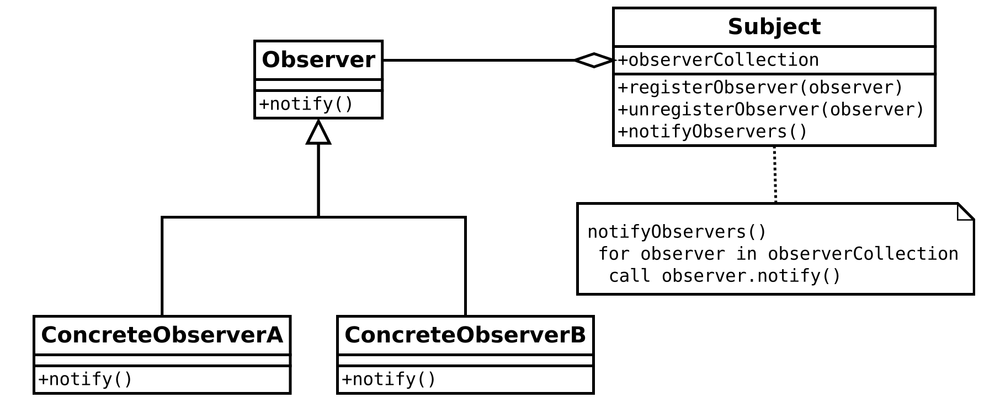

# observer patten

- 객체의 상태 변화를 관찰하는 관찰자들, 옵저버들의 목록을 객체에 등록하고 상태 변화가 있을 때마다 객체가 직접 목록의 각 옵저버에게 통지한다.
- 분산 이벤트 핸들링 시스템, 발행/구독 모델
- 옵저버 또는 리스너(listener)는 하나 이상의 객체를 관찰 대상이 되는 객체에 등록한다 -> 각각의 옵저버들은 관찰 대상인 객체가 발생시키는 이벤트를 받아 처리한다.
- 어떤 객체의 상태가 변할 때, 연관된 객체에게 알림
- 상태를 가지고 있는 주체 객체와 상태의 변경을 알아야 하는 관찰 객체(Observer Object)가 존재

````
public class Observer {
    public String message;

    public void receive(String message) {
        System.out.println(this.message + message);
    }
}
````
````
public class User extends Observer {
	
    public User(String message) {
        this.message = message;
    }
}
````
````
public class Notice {
    private List<Observer> observers = new ArrayList<Observer>();

    public void attach(Observer observer) {
        observers.add(observer);
    }

    public void detach(Observer observer) {
        observers.remove(observer);
    }

    public void notifyObservers(String message) {
        for (Observer observer : observers) {
            observer.receive(message);
        }
    }
}
````
````
public class Main {
    public static void main(String[] args) {
        Notice notice = new Notice();
        User user = new User("user");
        
        notice.attach(user);
       
        String message = "notice";
        notice.notifyObservers(message);
    }
}
````
https://ko.wikipedia.org/wiki/%EC%98%B5%EC%84%9C%EB%B2%84_%ED%8C%A8%ED%84%B4