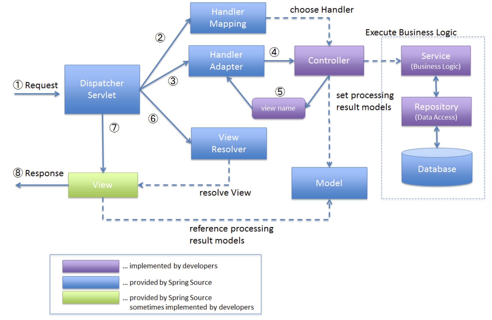

# MVC
- MVC는 소프트웨어 공학에서 사용되는 소프트웨어 디자인 패턴이다. 이 패턴을 성공적으로 사용하면, 사용자 인터페이스로부터 비즈니스 로직을 분리하여 애플리케이션의 시각적 요소나 그 이면에서 실행되는 비즈니스 로직을 서로 영향 없이 쉽게 고칠 수 있는 애플리케이션을 만들 수 있다. MVC에서 모델은 애플리케이션의 데이터를 나타내며, 뷰는 텍스트, 체크박스 항목 등과 같은 사용자 인터페이스 요소를 나타내고, 컨트롤러는 데이터와 비즈니스 로직 사이의 상호동작을 관리한다.

## M
- model, domain
- Model이란 프로그램이 작업하는 세계관의 요소들을 개념적으로 정의한다.
- 프로그램이 목표하는 작업을 원활하게 수행하기 위해 필요한 물리적 개체, 규칙, 작업등의 요소들을 구분한다.

## V
- view
- 사용자가 보는 화면에 입출력 과정 및 결과를 보여주기 위한 역할이다.
- 입출력의 순서나 데이터 양식은 컨트롤러에 종속되어 결정되고, 도메인 모델의 상태를 변환하거나, 받아서 렌더링하는 역할이다.
- view를 구현할 때 주의할 점은 도메인 로직의 어떤 것도 알고 있으면 안된다. 절대적으로 객체를 전달받아 상태를 바로 출력하는 역할만을 담당해야 한다.
- view에서는 도메인 객체의 상태를 따로 저장하고 관리하는 클래스 변수 혹은 인스턴스 변수가 있을 필요가 없다.
- view는 여러 개의 컨트롤러(Controller)를 가지고 있다. 사용자는 컨트롤러를 사용하여 모델의 상태를 바꾼다. 컨트롤러는 모델의 mutator 함수를 호출하여 상태를 바꾼다. 이때 모델의 상태가 바뀌면 모델은 등록된 뷰에 자신의 상태가 바뀌었다는 것을 알리고 뷰는 거기에 맞게 사용자에게 모델의 상태를 보여 준다.

## C
- controller
- controller는 model과 view를 연결 시켜주는 다리 역할을 함과 동시에 도메인 객체들의 조합을 통해 프로그램의 작동 순서나 방식을 제어한다.
- controller는 view와 model이 각각 어떤 역할과 책임이 있는 지 알고 있어야 한다.

### MVC 패턴 장점
- 사용자가 보는 페이지, 데이터처리, 그리고 이 2가지를 중간에서 제어하는 컨트롤, 이 3가지로 구성되는 하나의 애플리케이션을 만들면 각각 맡은바에만 집중을 할 수 있게 된다. 도메인을 작은 역할 단위로 분리하여 설계하는 것도 일종의 분업이라고 할 수 있지만 전체적인 구조에서도 MVC 패턴은 분업을 만들어 낼 수 있다. 서로 분리되어 각자의 역할에 집중할 수 있게끔하여 개발을 하고 그렇게 애플리케이션을 만든다면, 유지보수성, 애플리케이션의 확장성, 그리고 유연성이 증가하고, 중복코딩이라는 문제점 또한 사라지게 된다.

### DispatcherServlet
- DispatcherServlet는 Front Controller Pattern을 기반으로, 클라이언트의 모든 요청 접수한다. 요청에 대한 처리를 다른 컴포넌트들에게 위임한다.
  - Front Controller Pattern: 모든 요청을 하나의 컨트롤러에서 처리한다.
  
- HandlerMapping 사용자의 요청을 처리할 Controller가 무엇인지를 DispatcherServlet에 알린다. (@Controller로 선언되었거나 HttpRequestHandler 인터페이스로 구현한 클래스)
- DispatcherServlet에서 찾은 컨트롤러의 메소드를 실행하기 위해 HandlerAdapter객체에게 요청을 위임한다. HandlerAdapter는 사용자의 요청을 처리해줄 Controller를 호출하고 결과를 받아온다.
- ViewResolver는 사용자의 요청에 적합한 View를 반환해서 결과를 보여준다.

https://docs.spring.io/spring-framework/docs/3.0.0.RC2/spring-framework-reference/html/ch15s02.html   
https://terasolunaorg.github.io/guideline/5.0.1.RELEASE/en/Overview/SpringMVCOverview.html#overview-of-spring-mvc-processing-sequence  
https://www.javatpoint.com/spring-mvc-tutorial